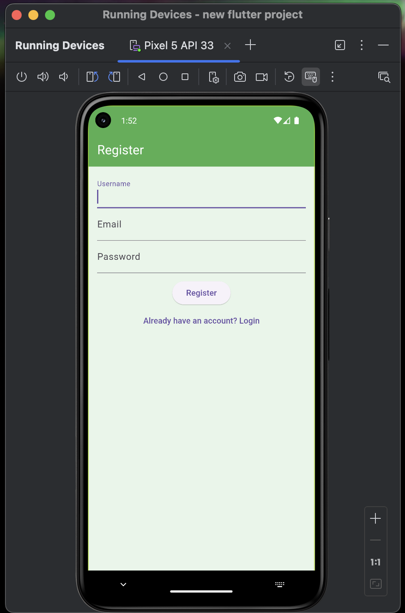
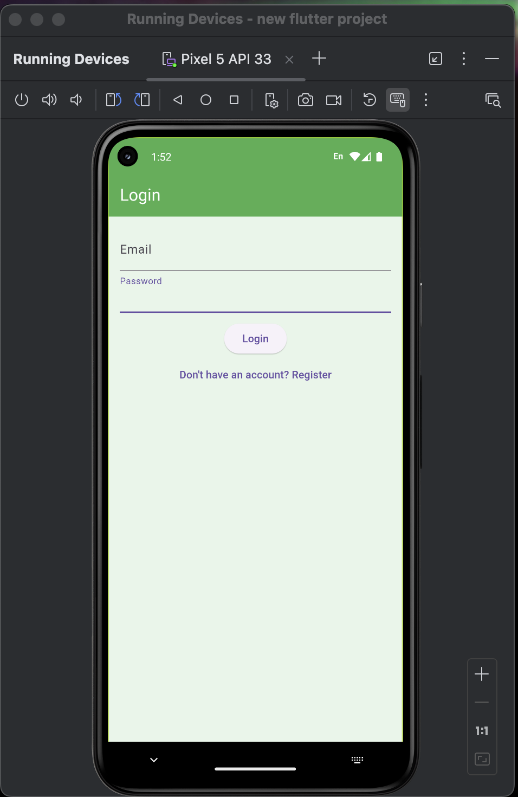
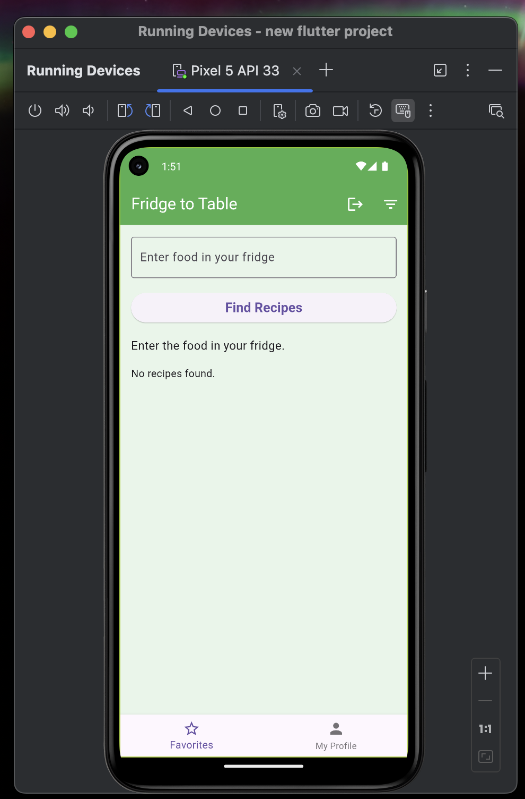
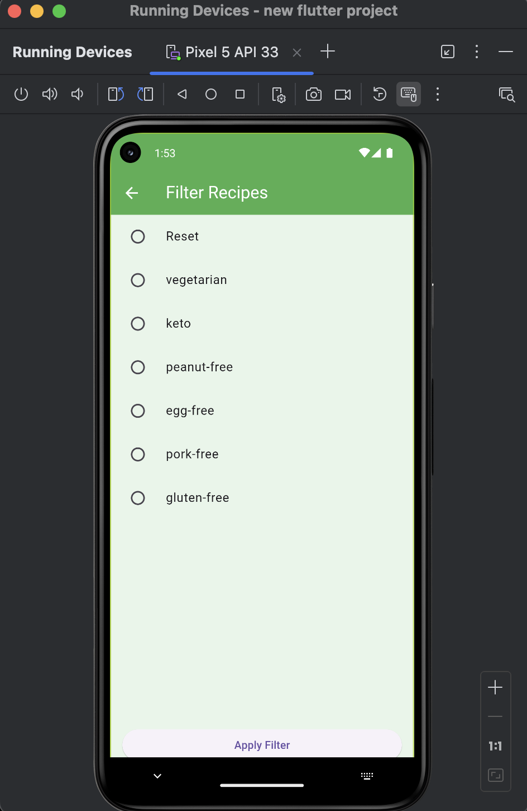
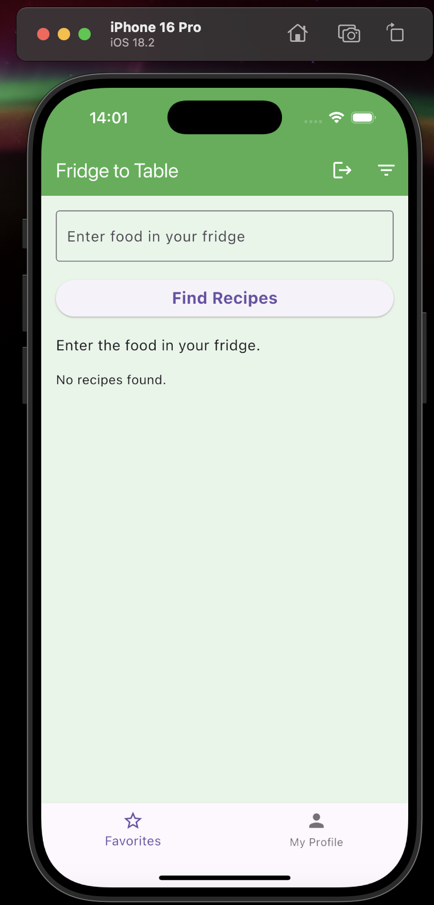
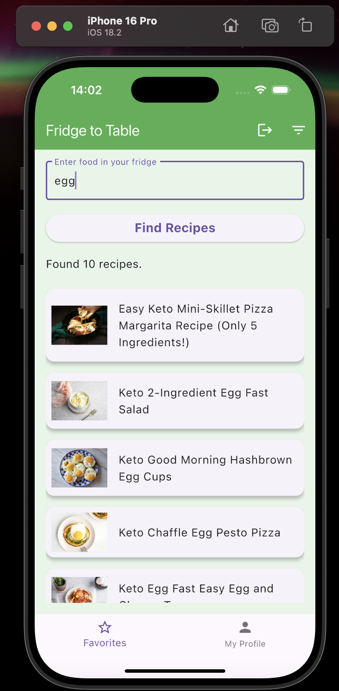
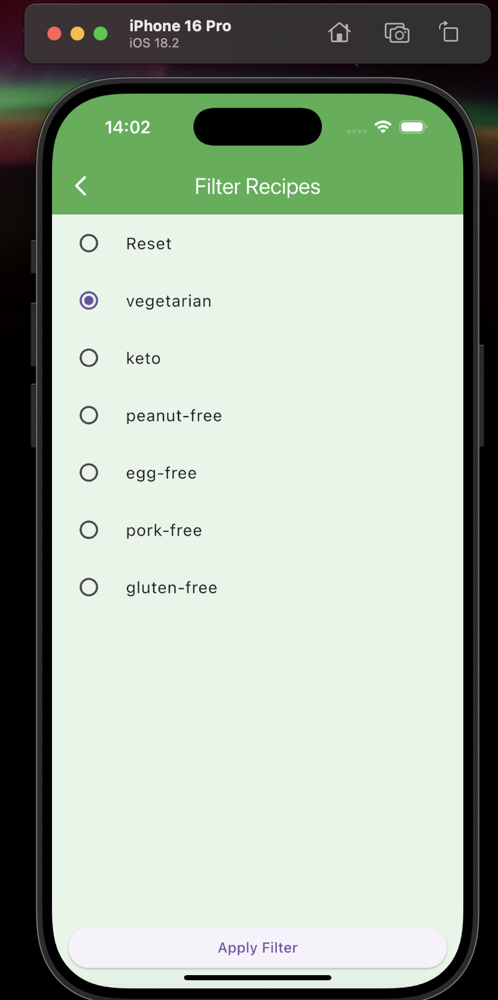
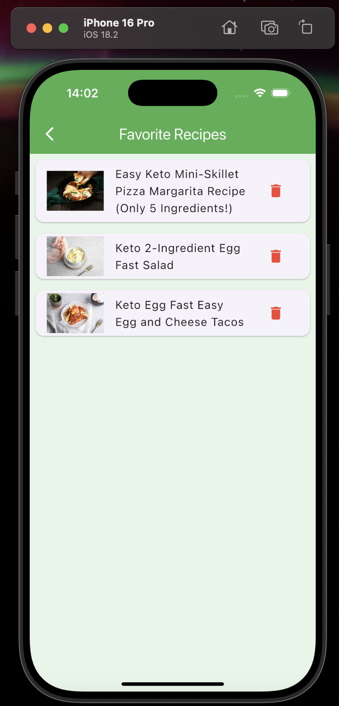
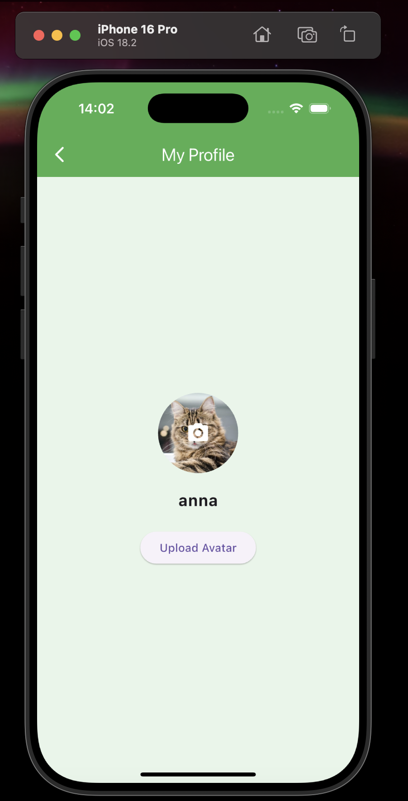

# Fridge to Food
A smart recipe app that helps you create delicious meals based on the ingredients in your fridge.

## Overview
Fridge to Table is a cross-platform mobile application built with Flutter. 
It allows users to search for recipes based on available ingredients, filter results based on dietary preferences, and save favorite recipes. 
Users can also manage their profiles and upload avatars.

## Tech Stack
 - Frontend: Flutter (Dart)
 - Backend: Node.js + Express.js
 - Database: MongoDB
 - Authentication: Firebase Authentication

## Features

 - Search recipes based on available ingredients
 - Filter recipes by dietary preferences (e.g., vegetarian, keto, gluten-free)
 - Save and manage favorite recipes
 - User authentication with Firebase
 - Profile management with avatar uploads
 - Cross-platform support (iOS & Android)

## How to run 
 - first run the backend and database from branch "backend"
 - flutter pub get
 - flutter run

## Screenshot 

### Android

  
  
  
  
  
  
  

### Ios

  
  
  
  
  
  
  
  

